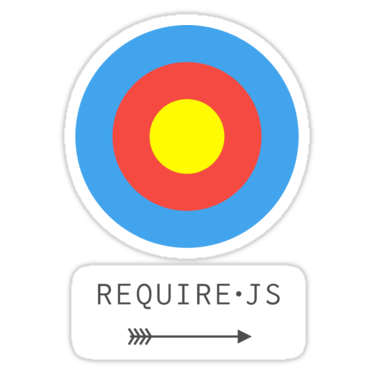

<!--   Welcome-img 106-->

<!--   my-icons -->

    
    
    
    
       

<!--   my-header-img -->

<!--   my-ticker -->

    
<!--   Profile views -->

  

<!--  About me -->

<h1 align="center" > About Me </h1>

<table>
  <tr>
    <td valign="top" width="50%">

- 🔭 I’m currently working on Github projects, blogs etc...
- 🌱 I’m currently learning Blockchain etc... 
- 👯 I’m looking to collaborate on projects, tech articles... 
- 💬 Talk to me about Python, JavaScript, Freelancing Opportunites, Open Source... 
- 📫 How to reach me **adwait.purao@spit.ac.in**
- ⚡ Fun fact : **All life is an experiment.The more you make the better.**

    </td>
    <td valign="top" width="50%">

<!--   -->

  </td>
  </tr>
</table>

<!--   My Trophies -->  

<h2 align="center" >My Trophies</h2>

  
      

<!--   Skills -->  

<h1 align="center" > Skills  </h1>
  
<table>
  <thead>
    <tr>
      <th>Domain</th>
      <th>Techstack</th>
    </tr>
  </thead>
  <tbody>
    <tr>
      <td>Languages</td>
      <td></td>
    </tr>
    <tr>
      <td>Front-End</td>
      <td>
	
 	
  	
   	
	
</td>
    </tr>
    <tr>
      <td>UI Frameworks</td>
      <td>
     
</td>
    </tr>
    <tr>
      <td>Backend</td>
      <td>
      
      
      
      
      
</td>
    </tr>
    <tr>
      <td>Data Science</td>
      <td></td>
    </tr>
    <tr>
      <td>Artificial Intelligence</td>
      <td></td>
    </tr>
    <tr>
      <td>Operating Systems</td>
      <td></td>
    </tr>
    <tr>
      <td>API Testing</td>
      <td></td>
    </tr>
    <tr>
      <td>Databases</td>
      <td>
      
	
	
      </td>
    </tr>
    <tr>
        <td>Big Data Analysis
		<td>
        
         
			 
			
		</td>
	</tr>
    <tr>
      <td>Version control & CI/CD</td>
      <td>
	    
</td>
    </tr>
    <tr>
      <td>Creatives and Web Design</td>
      <td>
          
	
      </td>
    </tr>
    <tr>
      <td>IDE's</td>
      <td></td>
    </tr>
    <tr>
      <td>Hosting</td>
      <td></td>
    </tr>
    <tr>
      <td>Extra</td>
      <td></td>
    </tr>
  </tbody>
</table>

<!--   Social-media-presence -->  
<h2 align="center" > Connect with me  </h2>
<a href = 'https://linkedin.com/in/adwait-p-04a4a222a' target="_blank"> &nbsp;</a> 
<a href = 'https://twitter.com/puraoadwait' target="_blank"> &nbsp;</a> 
<a href = 'https://medium.com/@adwait.purao' target="_blank"> &nbsp;</a> 
<a href = 'https://www.github.com/dare-marvel' target="_blank"> &nbsp;</a> 
<a href="https://fb.com/adwait.purao.1" target="_blank">&nbsp;</a>
<a href="https://instagram.com/adwaitpurao/" target="_blank">&nbsp;</a>

<!--   Coding Platforms on which I'm present --> 
<h2 align="center" >Coding platforms:</h2>    
<a href="https://www.codechef.com/users/adwait_purao" target="blank">&nbsp;</a>
<a href="https://www.hackerrank.com/adwait_purao" target="blank">&nbsp;</a>
<a href="https://www.leetcode.com/legendaryphoenix" target="blank">&nbsp;</a>
<a href="https://auth.geeksforgeeks.org/user/daremarvel" target="blank">&nbsp;</a>
<a href="https://codeforces.com/profile/HackerAdwait" target="blank">&nbsp;</a>
<a href="https://www.codingninjas.com/studio/profile/CodePhoenix" target="blank">&nbsp;</a>

<!--   Leetcode and medium stats -->
|Leetcode Stats | Medium Stats |
| ------------- | ------------- |
| |  |

<!--   GitHub stats graph -->

   
<h1 align="center" > My Github Stats 📈: </h1>
    

    
|  |  |
| ------------- | ------------- |

|  |  |
| ------------- | ------------- | 

<table>
  <tr>
    <td>
      
    </td>
    <td>
     
    </td>
  </tr>
</table>

<!--   Programming Humor and Real time moon -->     
<h2> Some Programming Humor for you  along with the Moon Today</h2>

| Joke | Moon |
| ------------- | ------------- |      
|  |  |  
    
<!--   Snake eating contributions -->      
## Watch the snake eat my contributions  

<!-- <picture>
  <source media="(prefers-color-scheme: dark)" srcset="github-snake-dark.svg" />
  <source media="(prefers-color-scheme: light)" srcset="github-snake.svg" />
   
    </picture> -->

